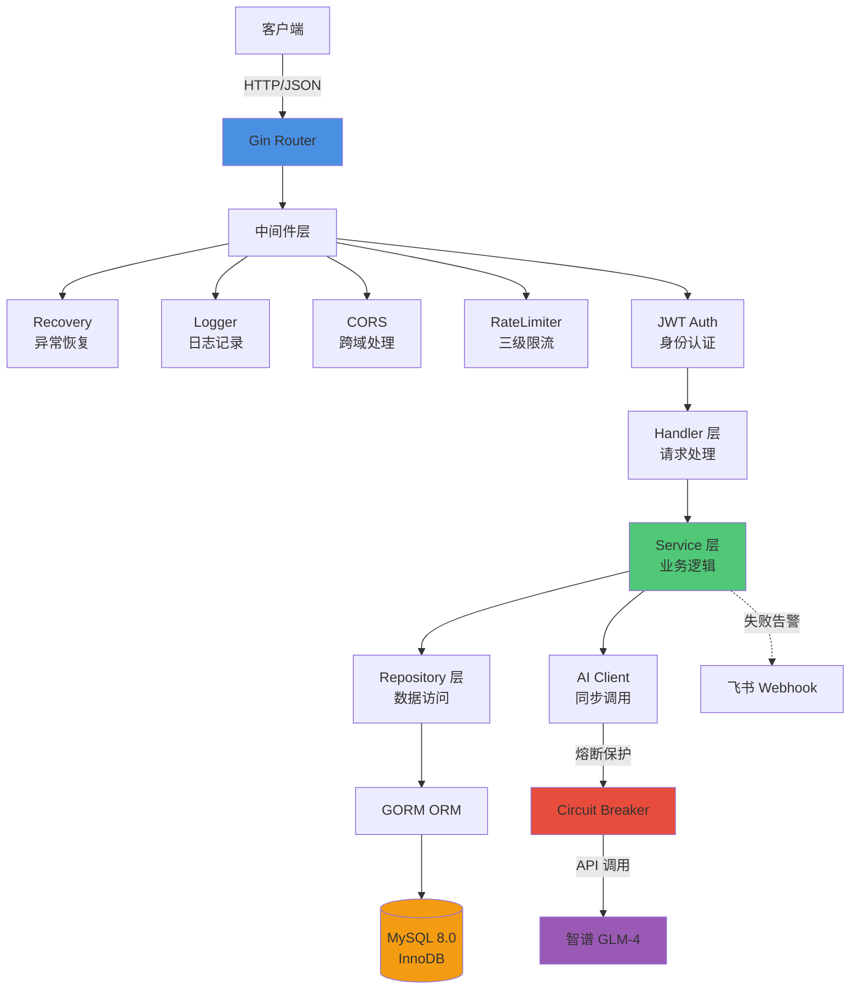
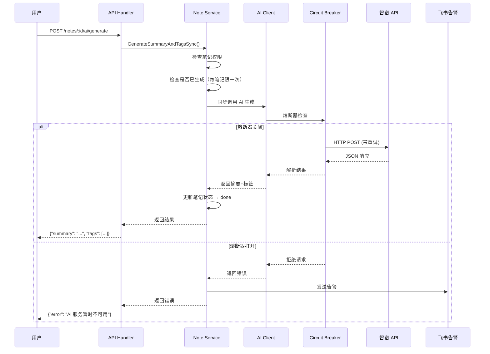
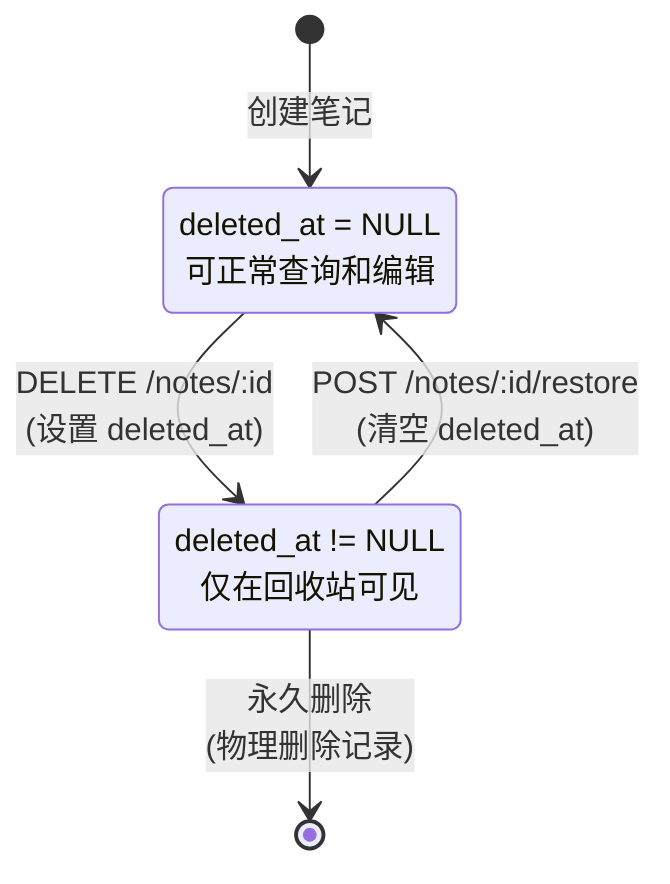
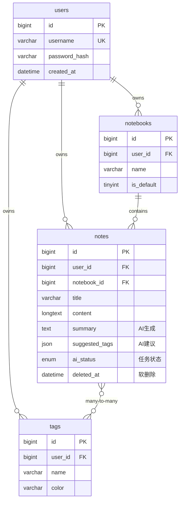

# 📒 WeNote - 智能笔记管理系统

[](https://go.dev/)
[](LICENSE)
[](https://github.com/yourusername/wenote/pulls)

> WeNote 是一个基于 Go 语言开发的高性能笔记管理系统，集成 AI 智能摘要与标签生成，具备完整的软删除机制、多级限流保护和熔断降级能力。


**说明**：本项目重点为后端架构设计与技术实现，前端为配套的演示界面。

---

## 🎯 项目亮点

### 核心业务功能
- ✅ **用户认证系统**：JWT 令牌 + bcrypt 密码加密
- ✅ **笔记本管理**：支持多笔记本组织，自动创建默认笔记本
- ✅ **笔记 CRUD**：标题、内容、标签、置顶、星标等完整功能
- ✅ **智能回收站**：软删除机制，支持批量恢复/永久删除
- ✅ **AI 智能助手**：基于智谱 GLM-4 的摘要生成与标签推荐
- ✅ **标签系统**：自定义标签 + 颜色管理
- ✅ **全文搜索**：基于 MySQL FULLTEXT 的中文分词搜索
- ✅ **审计日志**：完整记录用户操作轨迹

### 工程质量保障
- 🛡️ **三级限流**：全局/IP/用户级别保护，防止接口被刷
- 🔌 **熔断降级**：AI 服务故障自动熔断，保护主服务稳定
- 📊 **可观测性**：结构化日志 + 飞书告警（异常实时通知）

### 技术难点与解决方案

| 技术难点 | 核心解决方案 | 技术栈 |
|---------|---------|--------|
| **AI 服务稳定性** | 熔断器模式 + 指数退避重试 + 优雅降级 | gobreaker |
| **高并发请求** | 三级限流（全局/IP/用户）+ 令牌桶算法 | golang.org/x/time/rate |
| **AI 任务耗时** | Context 超时控制 + 同步调用 + 指数退避重试 | context.WithTimeout + gobreaker |
| **数据安全** | JWT 鉴权 + 行级权限校验 | golang-jwt/jwt |
| **查询性能优化** | 复合索引 + 联表优化 + GORM 预加载 | MySQL InnoDB |

---

## 🏗️ 系统架构



---

## 🔥 核心业务流程

### AI 智能摘要生成流程



### 笔记软删除状态流转



---

## 📊 技术栈

### 后端核心

| 分类 | 技术 | 版本 | 用途 |
|-----|------|------|------|
| **语言** | Go | 1.23 | 高性能并发处理 |
| **框架** | Gin | 1.9.1 | HTTP 路由与中间件 |
| **数据库** | MySQL | 8.0 | 持久化存储 |
| **ORM** | GORM | 1.25.5 | 数据访问层 |
| **认证** | JWT | 5.2.0 | 无状态身份验证 |
| **配置管理** | Viper | 1.18.2 | 多环境配置 |
| **AI 集成** | 智谱 GLM-4 | - | 文本摘要与标签生成 |

### 可靠性保障

| 技术 | 用途 | 实现方式 |
|-----|------|---------|
| **熔断器** | 防止 AI 服务雪崩 | gobreaker (失败率 50% 触发) |
| **限流** | 防止接口被刷 | Token Bucket 算法 |
| **重试** | 提高 AI 成功率 | 指数退避 (2s → 4s → 6s) |
| **告警** | 异常及时通知 | 飞书 Webhook |
| **审计** | 操作可追溯 | 审计日志表 |

---

## 🗄️ 数据库设计

### ER 图（核心表关系）



### 索引优化策略

```sql
-- 用户查询优化（覆盖 90% 查询场景）
INDEX idx_user_updated (user_id, updated_at DESC)

-- 回收站查询
INDEX idx_deleted_at (deleted_at)

-- AI 任务状态监控
INDEX idx_ai_status (ai_status)

-- 全文搜索（中文分词）
FULLTEXT INDEX ft_title_content (title, content) WITH PARSER ngram
```

---

## 🚀 快速开始

### 环境要求

- Go 1.23+
- MySQL 8.0+
- Docker & Docker Compose（推荐）

### 本地部署

#### 1. 克隆项目

```bash
git clone https://github.com/yourusername/wenote.git
cd wenote
```

#### 2. 配置数据库

```bash
# 执行初始化脚本
mysql -u root -p < wenote-backend/scripts/init.sql
```

#### 3. 配置后端

```bash
cd wenote-backend
cp config/config.example.yaml config/config.yaml
```

**⚠️ 重要：编辑 `config.yaml` 填入真实配置**

```yaml
# 数据库配置
database:
  host: localhost
  port: 3306
  username: root
  password: YOUR_DB_PASSWORD      # ⚠️ 修改为真实密码
  dbname: wenote

# JWT 配置
jwt:
  secret: YOUR_RANDOM_SECRET_KEY  # ⚠️ 生产环境请使用随机字符串（至少 32 位）
  expire: 168

# AI 配置（可选）
ai:
  zhipu:
    api_key: YOUR_ZHIPU_API_KEY   # ⚠️ 在 https://open.bigmodel.cn/ 获取
    model: glm-4-flash
```

#### 4. 启动后端服务

```bash
# 安装依赖
go mod download

# 运行服务
go run cmd/server/main.go
```

服务将启动在 `http://localhost:8080`

#### 5. Docker Compose 一键部署（推荐）

```bash
# 在项目根目录执行
docker-compose up -d
```

---

## 📡 API 文档

### 认证接口

| 方法 | 路径 | 说明 | 认证 |
|-----|------|------|------|
| POST | `/api/v1/auth/register` | 用户注册 | ❌ |
| POST | `/api/v1/auth/login` | 用户登录 | ❌ |

### 笔记接口

| 方法 | 路径 | 说明 | 认证 |
|-----|------|------|------|
| GET | `/api/v1/notes` | 获取笔记列表（支持搜索、筛选） | ✅ |
| POST | `/api/v1/notes` | 创建笔记 | ✅ |
| GET | `/api/v1/notes/:id` | 获取笔记详情 | ✅ |
| PATCH | `/api/v1/notes/:id` | 更新笔记 | ✅ |
| DELETE | `/api/v1/notes/:id` | 删除笔记（软删除） | ✅ |
| POST | `/api/v1/notes/:id/restore` | 恢复笔记 | ✅ |
| POST | `/api/v1/notes/:id/ai/generate` | AI 生成摘要和标签 | ✅ |
| GET | `/api/v1/notes/trash` | 获取回收站列表 | ✅ |
| POST | `/api/v1/notes/batch/delete` | 批量删除 | ✅ |
| POST | `/api/v1/notes/batch/restore` | 批量恢复 | ✅ |
| POST | `/api/v1/notes/batch/move` | 批量移动 | ✅ |

### 请求示例

#### 创建笔记

```bash
curl -X POST http://localhost:8080/api/v1/notes \
  -H "Authorization: Bearer YOUR_JWT_TOKEN" \
  -H "Content-Type: application/json" \
  -d '{
    "notebook_id": 1,
    "title": "Go 语言学习笔记",
    "content": "今天学习了 Goroutine 和 Channel...",
    "summary_len": 100,
    "tag_ids": [1, 2]
  }'
```

#### AI 生成摘要

```bash
curl -X POST http://localhost:8080/api/v1/notes/123/ai/generate \
  -H "Authorization: Bearer YOUR_JWT_TOKEN"
```

响应：

```json
{
  "code": 202,
  "message": "AI 任务已提交，正在后台处理"
}
```

---

## 🔐 安全机制

### 认证与授权

1. **密码加全**：使用 bcrypt 进行密码哈希（cost=10）
2. **JWT 令牌**：有效期 7 天，包含用户 ID 和用户名
3. **权限校验**：所有操作强制校验 `user_id`，确保用户只能操作自己的数据

### 限流策略

```yaml
# 三级限流配置
rate_limit:
  global_rate: 100    # 全局每秒 100 请求（防止服务过载）
  global_burst: 200   # 全局突发容量
  user_rate: 10       # 单用户每秒 10 请求（防止滥用）
  user_burst: 20      # 单用户突发容量
```

### 熔断降级

- **触发条件**：60 秒内失败率 ≥ 50% 且请求数 ≥ 5
- **降级策略**：AI 服务熔断后，笔记仍可正常创建（`ai_status=pending`）
- **恢复机制**：熔断 30 秒后自动尝试半开状态

---

## 📈 性能优化

### 数据库优化

1. **索引设计**
   - 复合索引 `(user_id, updated_at)` 覆盖主查询
   - 全文索引支持中文分词搜索

2. **查询优化**
   - 使用 GORM Preload 避免 N+1 查询
   - 软删除查询自动添加 `deleted_at IS NULL`

3. **连接池配置**
   ```yaml
   database:
     max_idle_conns: 10   # 最大空闲连接
     max_open_conns: 100  # 最大打开连接
   ```

### 并发控制

- **Context 超时**：单个 AI 任务最长 30 秒

---

## 🧪 测试

### 运行单元测试

```bash
cd wenote-backend
go test ./... -v
```

### API 集成测试

```bash
# 使用提供的测试脚本
python3 test_scenario.py
```

---

## 📦 项目结构

```
wenote-backend/
├── cmd/
│   └── server/
│       └── main.go              # 程序入口
├── config/
│   ├── config.yaml              # 配置文件（需手动创建）
│   ├── config.example.yaml      # 配置模板
│   └── config.go                # 配置解析
├── internal/
│   ├── handler/                 # HTTP 请求处理层
│   │   ├── auth.go
│   │   ├── note.go
│   │   ├── notebook.go
│   │   ├── tag.go
│   │   └── user.go
│   ├── middleware/              # 中间件
│   │   ├── auth.go              # JWT 认证
│   │   ├── cors.go              # 跨域处理
│   │   ├── limiter.go           # 限流（三级限流）
│   │   └── logger.go            # 日志记录
│   ├── model/                   # 数据模型
│   │   ├── note.go
│   │   ├── notebook.go
│   │   ├── tag.go
│   │   └── user.go
│   ├── repo/                    # 数据访问层
│   │   ├── db.go                # 数据库连接
│   │   ├── note.go
│   │   ├── notebook.go
│   │   ├── tag.go
│   │   └── user.go
│   ├── router/
│   │   └── router.go            # 路由注册
│   └── service/                 # 业务逻辑层
│       ├── auth.go
│       ├── note.go              # 核心业务（AI 同步处理）
│       ├── notebook.go
│       ├── tag.go
│       └── user.go
├── pkg/                         # 公共工具包
│   ├── ai/
│   │   ├── client.go            # AI 客户端接口
│   │   └── zhipu.go             # 智谱 API 实现（熔断+重试）
│   ├── alert/
│   │   └── feishu.go            # 飞书告警
│   ├── hash/
│   │   └── hash.go              # bcrypt 密码加密
│   ├── jwt/
│   │   └── jwt.go               # JWT 令牌生成与验证
│   ├── logger/
│   │   └── logger.go            # 结构化日志
│   └── response/
│       └── response.go          # 统一响应格式
├── scripts/
│   └── init.sql                 # 数据库初始化脚本
├── go.mod
└── go.sum
```

---

## 🛠️ 配置模板说明

### `config.yaml` 配置项

| 配置项 | 说明 | 是否必填 |
|--------|------|----------|
| `database.password` | 数据库密码 | ✅ 必填 |
| `jwt.secret` | JWT 签名密钥（生产环境必须修改） | ✅ 必填 |
| `ai.zhipu.api_key` | 智谱 API Key（不配置则 AI 功能不可用） | ❌ 可选 |

### 获取智谱 API Key

1. 访问 [智谱 AI 开放平台](https://open.bigmodel.cn/)
2. 注册并实名认证
3. 创建 API Key（新用户有免费额度）
4. 将 API Key 填入 `config.yaml` 的 `ai.zhipu.api_key`

---

## 🎓 技术要点

### 1. AI 服务可靠性设计

**问题**：第三方 AI API 可能超时、限流或故障

**解决方案**：
- ✅ 同步调用：直接返回结果，用户体验更直观
- ✅ 熔断保护：失败率过高自动熔断，保护主服务
- ✅ 指数退避：2s → 4s → 6s 重试间隔
- ✅ 降级策略：AI 失败不影响笔记创建
- ✅ 超时控制：单个 AI 任务最长 30 秒

### 2. 高并发场景下的限流

**问题**：恶意刷接口导致服务崩溃

**解决方案**：
- ✅ 全局限流：整体 QPS 上限（100/s）
- ✅ IP 限流：单 IP 限制（20/s），防爬虫
- ✅ 用户限流：单用户限制（10/s），防滥用
- ✅ 令牌桶算法：支持突发流量

### 3. 软删除与数据恢复

**问题**：用户误删除后无法找回

**解决方案**：
- ✅ `deleted_at` 字段标记删除时间
- ✅ 查询自动过滤已删除数据（GORM Soft Delete）
- ✅ 回收站独立接口（`WHERE deleted_at IS NOT NULL`）
- ✅ 支持批量恢复和永久删除

### 4. 复杂 SQL 查询优化

**场景**：笔记列表需要同时查询标签、笔记本、过滤条件

**优化**：
```go
// 使用 GORM Preload 避免 N+1 查询
db.Preload("Tags").Preload("Notebook").Find(&notes)

// 复合索引覆盖查询
INDEX idx_user_updated (user_id, updated_at DESC)
```

---

## 📞 联系方式

- **项目作者**：[你的姓名]
- **邮箱**：your.email@example.com
- **GitHub**：[@yourusername](https://github.com/yourusername)

---

## 📄 License

本项目采用 MIT 许可证，详见 [LICENSE](LICENSE) 文件。

---

## 🙏 致谢

感谢我的导师 **王申跃** 在项目开发过程中的悉心指导与帮助。

感谢以下开源项目：
- [Gin](https://github.com/gin-gonic/gin) - HTTP 框架
- [GORM](https://gorm.io/) - ORM 库
- [智谱 AI](https://open.bigmodel.cn/) - AI 能力支持

---

**⭐ 如果这个项目对你有帮助，欢迎 Star！**
